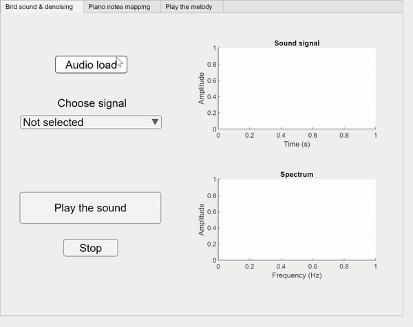

# piano-from-bird

Authors: Yang Jiao, [Jifei Zhao](https://github.com/fifisn)

Composition and instrumental music generation from bird songs using time-frequency analysis

This is a repo for the course project of EIE3510 Digital Signal Processing (FA21) at [CUHK-Shenzhen](https://www.cuhk.edu.cn/en).

Local environment: MATLAB with [Signal Processing Toolbox](https://www.mathworks.com/products/signal.html)

## Executing the Code

* Make sure to turn on your computer sound when running the code!
* `main.m` The complete process of noise filtering, composition, and piano sound generation;
* `mainAPP.mlapp` The graphical interface to demonstrate the breakdown of all components in this project. See the Appendix in [project report](media/EIE3510_project_report.pdf) for a more detailed user manual;
* `piano_violin.m` Demo of a few notes on how we mimic the piano and violin sounds.

